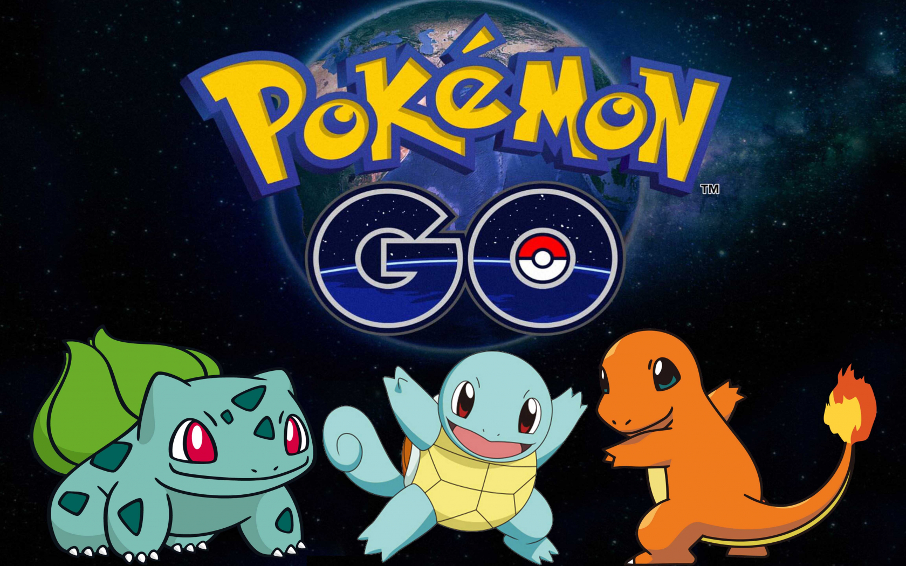
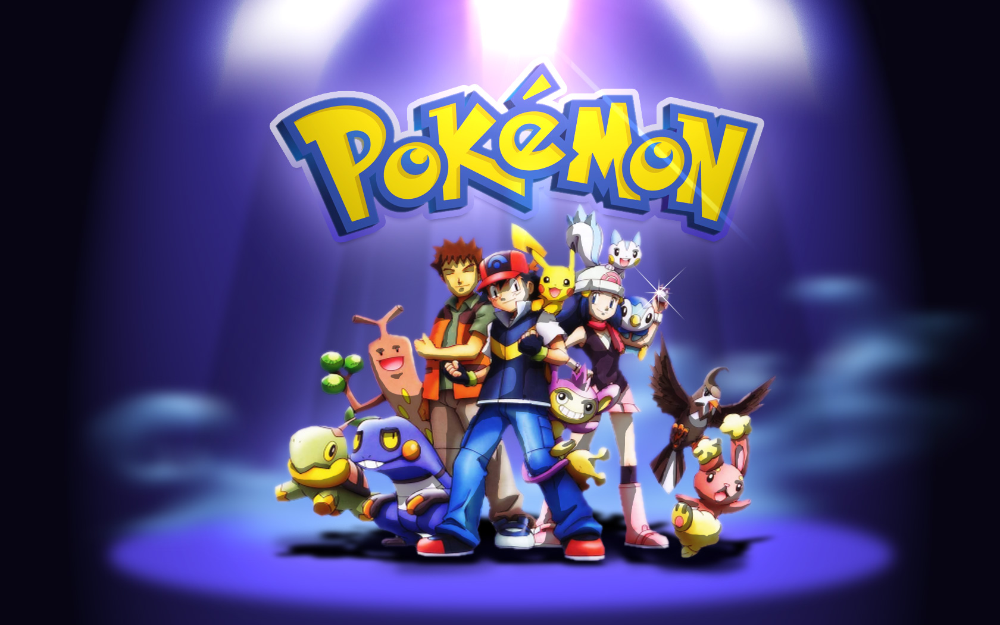
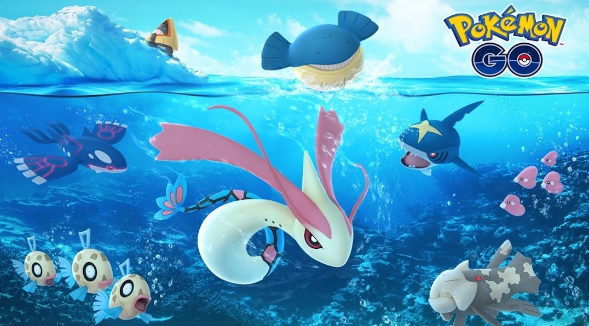
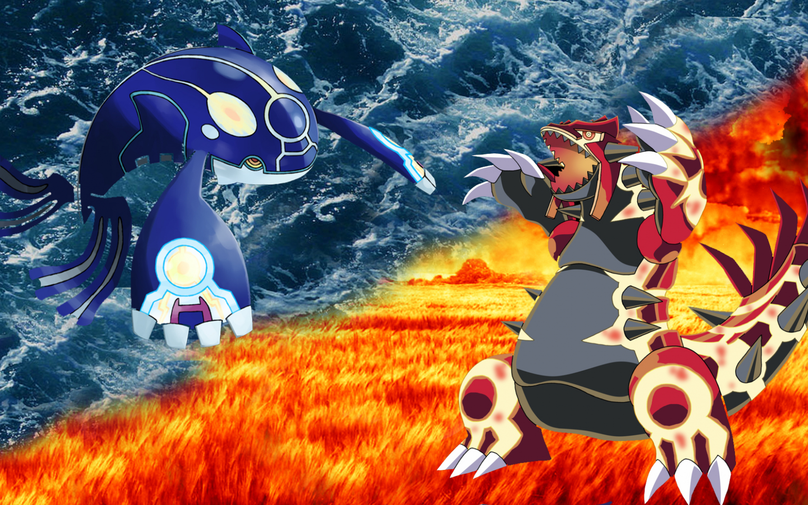
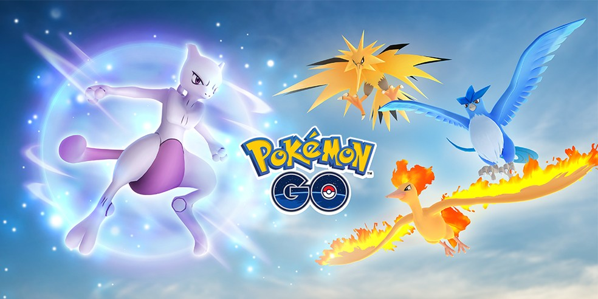
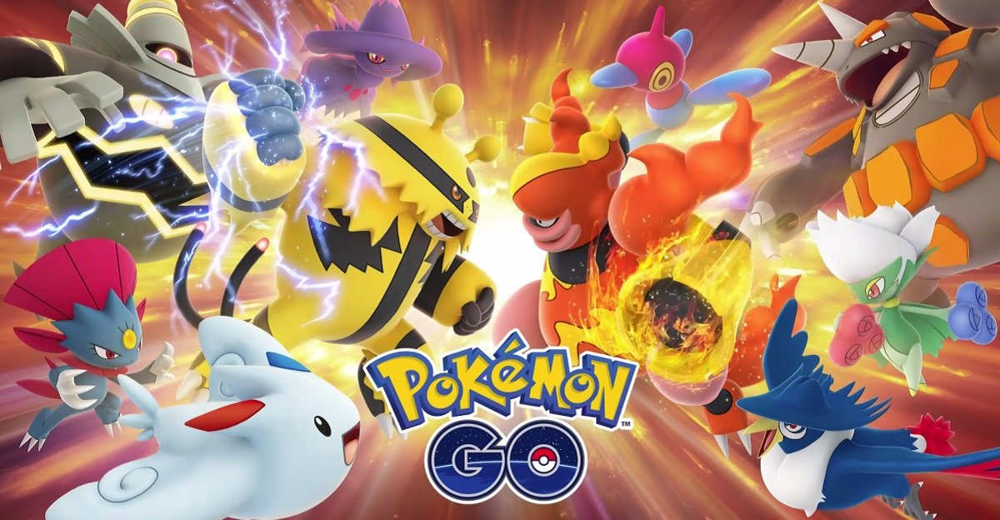

<!doctype html>
<html lang="pt-pt">
    <head>
        <!-- Required meta tags -->
        <meta charset="utf-8">
        <meta name="viewport" content="width=device-width, initial-scale=1, shrink-to-fit=no">

        <!-- Bootstrap CSS -->
        <link rel="stylesheet" href="node_modules/bootstrap/compiler/bootstrap.css">

        <link rel="stylesheet" href="node_modules/bootstrap/compiler/style.css">

        <title>Pokémon Go</title>
    </head>
    <body>

        <nav class="navbar navbar-expand-lg navbar-dark bg-gradient-primary">

            

                <a class="navbar-brand h1 mb-0" href="#">Pokémon Go</a>

                <button class="navbar-toggler" type="button" data-toggle="collapse" data-target="#navbarSite">
                    
                </button>

                

                    <ul class="navbar-nav mr-auto">

                        <li>
                            <a class="nav-link" href="#">Início</a>
                        </li>
                        <li>
                            <a class="nav-link" href="#">Como funciona</a>
                        </li>
                        <li>
                            <a class="nav-link" href="#">Jogabilidade</a>
                        </li>
                        <li>
                            <a class="nav-link" href="#">Poképarada</a>
                        </li>
                        <li>
                            <a class="nav-link" href="#">PVP</a>
                        </li>

                    </ul>

                    <ul class="navbar-nav ml-auto">

                        <li class="nav-item dropdown">

                            <a class="nav-link dropdown-toggle" href="#" data-toggle="dropdown" id="navDrop">
                                Social
                            </a>
                            

                                <a class="dropdown-item" href="https://www.facebook.com/Pokemon/" target="_blank">Facebook</a>
                                <a class="dropdown-item" href="https://twitter.com/pokemon/" target="_blank">Twitter</a>
                                <a class="dropdown-item" href="https://www.instagram.com/pokemon/" target="_blank">Instagram</a>
                                <a class="dropdown-item" href="https://www.youtube.com/user/pokemon/" target="_blank">Youtube</a>
                            

                        </li>

                    </ul>

                    <form class="form-inline">
                        <input class="form-control ml-4 mr-2" type="search" placeholder="Pesquisar...">
                        <button class="btn btn-light" type="Sbmit">Ok</button>
                    </form>
        
                

            

        </nav>

        

            <ol class="carousel-indicators">
                <li data-target="#caroselSite" data-slide-to="0" class="active"></li>
                <li data-target="#caroselSite" data-slide-to="1"></li>
                <li data-target="#caroselSite" data-slide-to="2"></li>
            </ol>
            
            

                

                    

                    

                        <h1>Desenho animado Pokémon</h1>
                        
A série de televisão de desenho animado Pokémon mostra as aventuras de Ash Ketchum, 
                            seu companheiro Pikachu e de muitos amigos e Pokémon incríveis. As aventuras deles 
                            também chegaram à telona com vários longas de desenho animado.

                    

                

                

                    

                    

                        <h1>Pokémon Estampas Ilustradas</h1>
                        
O jogo Pokémon Estampas Ilustradas permite aos jogadores criar baralhos e batalhar 
                            usando seus Pokémon favoritos. O jogo é simples o suficiente para que novos jogadores 
                            consigam aprender a jogar rapidamente, mas amplo o suficiente para proporcionar muita 
                            diversão e criatividade para todos os jogadores. Há também muitos fãs de Pokémon que 
                            amam colecionar as cartas do jogo Pokémon Estampas Ilustradas, que são ricamente ilustradas.

                    

                

                <!--div class="carousel-item">

                    

                    

                        <h1>Videogames Pokémon</h1>
                        
Milhões de fãs de Pokémon descobriram o mundo Pokémon por meio de suas aventuras nos jogos 
                            de videogame durante os últimos 20 anos. De jogos elaborados de RPG Pokémon até jogos 
                            rápidos de quebra-cabeças, os jogos da Pokémon continuam a proporcionar novas experiências 
                            para os Treinadores nos consoles da Nintendo e em dispositivos móveis.

                    

                </div-->

                

                    

                    

                        <h1>Competições Oficiais Pokémon</h1>
                        
O programa Play! Pokémon oferece aos jogadores a oportunidade de se reunirem em eventos 
                            competitivos emocionantes e divertidos. Este programa oferece eventos para jogadores de 
                            todos os níveis: de eventos informais, como é o caso das ligas Pokémon até eventos de 
                            alto prestígio, como é o caso da Série de Campeonatos, sempre mantendo uma ênfase na 
                            diversão desportiva.

                    

                

            

            <a class="carousel-control-prev" href="#carouselSite" role="button" data-slide="prev">
                
                Anterior
            </a>
            <a class="carousel-control-next" href="#carouselSite" role="button" data-slide="next">
                
                Avançar
            </a>
        

        

            

                

                    <h1 class="display-3">Pokémon Go</h1>
                    
Os fãs de Pokémon por toda a parte podem desfrutar do mundo Pokémon de várias formas. 
                        Os produtos da marca Pokémon incluem videogames, o jogo de cartas Pokémon Estampas 
                        Ilustradas, a série de televisão de desenho animado, filmes, brinquedos e muito mais.

                

            
 

            

                

                    <nav id="navbarVertical" class="navbar navbar-light bg-light">

                        <nav class="nav nav-pills flex-column">

                            <a class="nav-link" href="#item1">Pokemon</a>

                            <nav class="nav nav-pills flex-column">

                                <a class="nav-link ml-3" href="#item1-1">Lançamento</a>

                                <a class="nav-link ml-3" href="#item1-2">Go Plus</a>

                            </nav>

                            <a class="nav-link my-2" href="#item2">Criticas</a>

                            <a class="nav-link my-2" href="#item3">Analises</a>

                            <nav class="nav nav-pills flex-column">

                                <a class="nav-link ml-3" href="#item3-1">Atualidade</a>

                                <a class="nav-link ml-3" href="#item3-2">Conclusoes</a>

                            </nav>

                        </nav>

                    </nav>

                

                

                    

                        <h4 id="item1">Pokemon</h4>
                        
Pokémon GO é um jogo eletrônico free-to-play de realidade aumentada 
                            voltado para smartphones. O jogo é desenvolvido entre a Niantic, Inc., 
                            a Nintendo e a The Pokémon Company para as plataformas iOS e Android.

                        <h5 id="item1-1">Lançamento do Jogo</h5>
                        
O jogo foi inicialmente lançado em julho de 2016 para alguns países, 
                            eventualmente expandindo para o resto do mundo. Com o uso do sistema de 
                            posicionamento global (GPS) e a câmera de dispositivos compatíveis, o jogo 
                            permite aos jogadores capturar, batalhar, e treinar criaturas virtuais 
                            chamadas Pokémon, as quais aparecem nas telas de dispositivos como se 
                            fossem no mundo real.

                        <h5 id="item1-2">Go Plus</h5>
                        
Um acessório opcional, o Pokémon Go Plus, alerta os usuários quando Pokémon 
                            estiverem nas proximidades.

                        <h4 id="item2">Criticas</h4>
                        
Pokémon GO foi lançado com críticas equilibradas.

                        <h4 id="item3">Analises</h4>
                        
Os analistas elogiaram o conceito do jogo e o estímulo para que os jogadores 
                            se tornassem mais ativos no mundo real, embora criticassem os frequentes 
                            problemas técnicos que se evidenciaram no lançamento.

                        <h5 id="item3-1">Atualidade</h5>
                        
Apesar dessas críticas, o jogo se tornou um fenômeno global e um dos aplicativos 
                            móveis mais utilizados em 2016, baixado mais de 750 milhões de vezes em todo o 
                            mundo.

                        <h5 id="item3-2">Conclusoes</h5>
                        
Foi-lhe creditada a popularização dos jogos baseados em geolocalização e realidade 
                            aumentada, com estímulo à atividade física dos jogadores e movimentando os 
                            negócios locais. No entanto, o jogo também atraiu controvérsias ao contribuir 
                            para a ocorrência de acidentes e perturbação da ordem pública.

                    

                

            

            

                

                    

                        
                        

                            <h4 class="card-title">Imagem 1</h4>
                            <h6 class="card-subtitle mb-2 text-muted">Subtitulo imagem 1</h6>
                            
Descrição imagem 1

                        

                        <ul class="list-group list-group-flush">
                            <li class="list-group-item">Item 1</li>
                            <li class="list-group-item">Item 2</li>
                            <li class="list-group-item">Item 3</li>        
                        </ul>
                        

                            <a href="#" class="card-link" data-toggle="modal" data-target="#siteModal">Pokemon</a>
                        

                        

                            Rodape
                        

                    

                
            

                

                    

                        
                        

                            <h4 class="card-title">Imagem 2</h4>
                            <h6 class="card-subtitle mb-2 text-muted">Subtitulo imagem 2</h6>
                            
Descrição imagem 2

                        

                        <ul class="list-group list-group-flush">
                            <li class="list-group-item">Item 1</li>
                            <li class="list-group-item">Item 2</li>
                            <li class="list-group-item">Item 3</li>        
                        </ul>
                        

                            <a href="#" class="card-link" data-toggle="modal" data-target="#siteModal">Pokemon</a>
                        

                        

                            Rodape
                        

                    

                
                

                

                    

                        
                        

                            <h4 class="card-title">Imagem 3</h4>
                            <h6 class="card-subtitle mb-2 text-muted">Subtitulo imagem 3</h6>
                            
Descrição imagem 3

                        

                        <ul class="list-group list-group-flush">
                            <li class="list-group-item">Item 1</li>
                            <li class="list-group-item">Item 2</li>
                            <li class="list-group-item">Item 3</li>        
                        </ul>
                        

                            <a href="#" class="card-link" data-toggle="modal" data-target="#siteModal">Pokemon</a>
                        

                        

                            Rodape
                        

                    

                

                
            

        

        <!-- modal -->

        

            

                

                    

                        <h5 class="modal-title">Pokemon</h5>
                        <button type="button" class="close" data-dismiss="modal">
                            &times;
                        </button>
                    

                    

                        
Vou apanha-los todos!

                    

                    

                        <button type="button" class="btn btn-danger" data-dismiss="modal">Fechar</button>
                    

                

            

        

        <!-- Optional JavaScript; choose one of the two! -->

        <!-- Option 1: jQuery and Bootstrap Bundle (includes Popper) 
        
        
        -->

        <!-- Option 2: jQuery, Popper.js, and Bootstrap JS-->
        
        
        
    
    </body>
</html>
